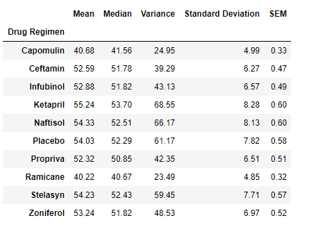
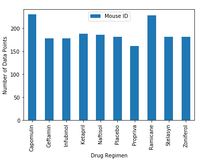
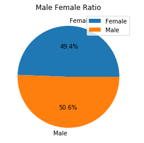
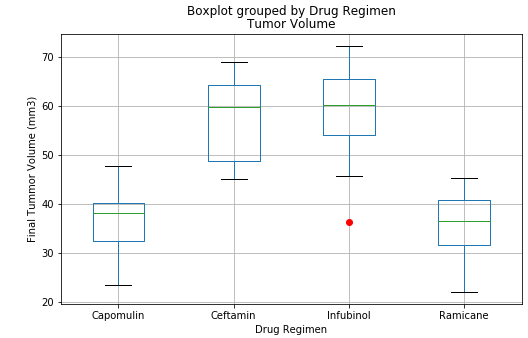
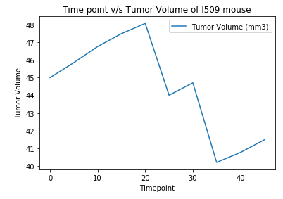
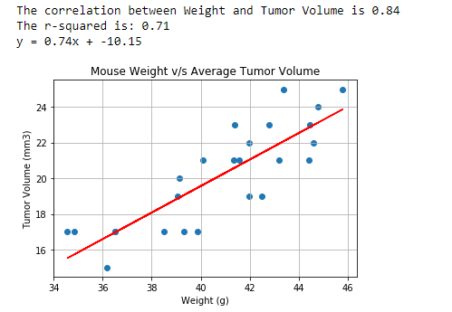
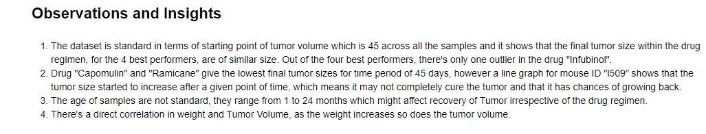

# Tumor Trreatment of Mice with Matplotlib 
A pharmaceutical company in its most recent efforts, began screening for potential treatments for squamous cell carcinoma (SCC), a commonly occurring form of skin cancer.In this study, 250 mice identified with SCC tumor growth were treated through a variety of drug regimens. Over the course of 45 days, tumor development was observed and measured. The purpose of this study was to compare the performance of Pymaceuticals' drug of interest, Capomulin, versus the other treatment regimens.

## Tools and Technologies used and required to run the file
* Python 3- Matplotlib, Pandas, Scipy
* Jupyter Notebook

## How to run the code
1. Download the folder Pymaceuticals
2. Open Jupyter Notebook and open the file pymaceuticals.ipynb
3. Run all the cells by Kernel -> Restart and Run all

## Ouput 
* Summary statistics for each Drug Regimen

* Number of data points to make sure none of the regimens have lower samples as compared to others causing bias. 

* Male Female ratio in the dataset is somewhat equal, so that the study is not biased in case any regimen was better for a particular gender 

* Final Tumour Volume of each sample for 4 most promising Drug Regimens, their mean and outlier for cases where the drug didn't perform as expected or outperformed itself.

* The trend of tumour volume during the time of Treatment for a partiular mouse treated with Capomulin. (Can be viewed for any mouse ID just by changing the ID)

* Correlation between weight of the sample and its Tumour Volume 

* Noted Observations from the analysis

